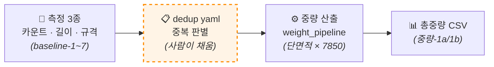

# steel-qto

> 건설 도면(DXF 파일)에서 철골 부재의 물량을 자동으로 산출하는 PoC.

---

## 1. 이게 뭔가요?

사람이 직접 도면을 보며 손으로 세고·재고·곱해야 했던 작업을 도구가 대신해줍니다.

도면 한 장(또는 여러 장)에서 철골 기둥의 **부호 개수 · 길이 · 규격**을 자동으로 측정하고,
부재별 단위중량을 곱해 **총중량 CSV**를 만들어 냅니다.

- **현재까지 완성한 것**: 도면 5장 통합 기둥 총중량 — **188,726.7 kg / 109개** (PoC v1)
- **다음 단계 후보**: 보(beam) 부재까지 확장 · 단위중량 정확화 · AI로 규칙 자동화
- **검증 방법**: 누구나 클론 후 `pytest` 실행하면 **263개 테스트 통과 / 2개 알려진 한계** 재현됨

---

## 2. 도구가 어떻게 일하나요?



**흐름 설명**:

1. **측정 3종** — 도구가 도면 파일에서 자동으로 세 가지 값(부호 개수·길이·규격)을 뽑아냅니다.
2. **dedup yaml** — 같은 부호가 여러 시트에 나올 때 "어느 시트를 진짜로 칠지" 결정해야 하는데, 이건 도구가 모릅니다. 그래서 **사람이 yaml 파일에 결정을 적어둡니다.**
3. **중량 산출** — 측정값과 사람의 결정을 결합해 각 부재의 중량을 계산합니다.
4. **총중량 CSV** — 엑셀로 열어볼 수 있는 결과물.

> 💡 점선 박스(dedup yaml)는 현재 사람이 손으로 채우는 자리예요.
> 이게 **다음 단계에서 AI가 대신 채우게 될 자리**입니다.

---

## 3. 어떻게 시작하나요? (환경 세팅 4단계)

**준비물**: Python 3.11 (필수, 3.12 이상은 호환 미검증) · Git

```bash
# ① 깃헙에서 코드 받기
git clone https://github.com/rangedayo/steel-qto.git
cd steel-qto

# ② 격리된 파이썬 환경 만들고 필요한 라이브러리 설치
python -m venv .venv
.venv\Scripts\activate          # Windows
# source .venv/bin/activate     # Mac/Linux
pip install -r poc_v2/requirements.txt

# ③ 도면 파일(DXF) 5종을 sample_data/ 폴더에 배치
#    DXF는 기밀 자료라 깃헙에 포함되지 않습니다.
#    Notion 비공개 채널에서 받아 sample_data/ 폴더에 옮겨주세요.
#    (정답지 xlsx 2종은 클론할 때 함께 받아져 있습니다)

# ④ 도구가 잘 돌아가는지 확인
pytest -v poc_v2/
# 기대 결과: 263 passed / 2 known-fail (도면2 SC1·SC2)
```

### ⚠️ 한글 Windows 사용자 주의

`pip install` 중 `UnicodeDecodeError` 같은 오류가 뜨면, 명령 프롬프트에서 아래 명령 후 다시 시도하세요:

```bash
set PYTHONUTF8=1
```

또는 시스템 환경변수에 `PYTHONUTF8=1` 영구 등록 권장.

---

## 4. 1분 안에 첫 결과 보기

도구가 어떻게 결과를 내는지 직접 확인하고 싶다면:

```bash
# 도면4 한 장의 총중량 CSV 생성
python -m poc_v2.qto.export_weight_csv --drawing 도면4

# 5장 통합 — PoC v1의 본 결과물 재생성
python -m poc_v2.qto.export_weight_csv --all
```

→ `outputs/` 폴더에 CSV 파일이 생성됩니다. 엑셀로 열어 부호별 총중량을 확인할 수 있어요.

---

## 5. 폴더 구조

| 폴더 | 역할 |
|---|---|
| `config/` | 사람이 손으로 채우는 결정 파일들 (yaml 5종) |
| `poc_v2/` | 도구 코드 본체 (측정 · 중량 산출 로직) |
| `reference_materials/` | 정답지 엑셀 2개 (도구가 맞게 측정하는지 검증용) |
| `sample_data/` | 도면 파일 들어갈 자리 — Notion에서 받아 직접 배치 |
| `outputs/` | 결과물·라운드 보고서·CSV가 생성되는 곳 |
| `docs/` | 가이드 문서 (라운드 역사 + 도메인 규칙) |

### 자세한 트리

```
config/
├── symbol_rules.yaml           부재 부호 화이트리스트 (어떤 게 부재고 어떤 게 아닌지)
├── length_routing.yaml         길이 측정할 시트 라우팅
├── sheet_name_overrides.yaml   시트명 자동 매칭 실패 시 보조 매핑
├── dedup_routing.yaml          ★ 중복 판별 (가장 중요한 결정 파일)
└── unit_weight_table.yaml      단위중량 참조표

poc_v2/
├── tests/        부호 카운트 회귀 테스트
├── length/       길이·규격 측정 모듈
├── baseline2/    작은 도면 입력 처리 (baseline-2~7 누적)
├── qto/          ★ 중량 산출 — PoC v1의 본 deliverable
├── app.py        브라우저 UI (Streamlit)
└── requirements.txt
```

---

## 6. 새 도면 추가하는 법

새 도면을 추가하려면 `config/` 폴더의 yaml 파일들을 채워야 합니다.
사람의 결정이 필요한 4종:

| 파일 | 무엇을 적나요 |
|---|---|
| `symbol_rules.yaml` | 이 도면에 등장하는 부재 부호 (MC1, SC1 등). 기초·철근·상세참조는 자동으로 제외됨 |
| `length_routing.yaml` | 어느 시트에서 어느 부호의 길이를 측정할지 |
| `sheet_name_overrides.yaml` | 시트명 자동 매칭이 실패하는 케이스만 등록 (최소화 원칙) |
| `dedup_routing.yaml` | 같은 부호가 여러 시트에 나올 때 어느 시트를 본체로 칠지 |

### `dedup_routing.yaml`에서 쓸 수 있는 키워드

| 키워드 | 의미 |
|---|---|
| `count_from` / `spec_from` | 카운트와 규격을 가져올 시트를 분리 |
| `by_section` | 동(棟)별로 분리해서 산출 (예: 도면1의 1동·2동) |
| `skip` | 측정 소스가 없는 동/구역을 산출 대상에서 제외 |
| `count_override` | 측정 한계 케이스에서 정답지 값을 직접 박아넣어 격리 |

> 📘 자세한 도메인 규칙은 [`docs/domain_rules_seed.md`](docs/domain_rules_seed.md) 참고

---

## 7. 알려진 한계 (숨기지 않고 적어둔 4종)

| # | 한계 | 어떻게 처리했나 |
|---|---|---|
| 1 | 도면2 SC1·SC2 카운트가 0으로 나옴 (블록 내부에 부호가 분리 저장된 데이터 한계) | `count_override`로 정답지 값으로 격리 (테스트 2개 실패로 남음) |
| 2 | 도면1 1동 기둥 길이 산출 불가 (골구도·단면도 시트가 도면에 아예 없음) | `skip`으로 산출 대상에서 제외 |
| 3 | 도면5 Y1축열 길이 측정 (측정 소스 시트 차이) | 라우팅에서 주단면도 소스 사용 |
| 4 | 단위중량 식이 KS D 3502 표 대비 -2~3% 오차 (4세그먼트 단면적 근사) | 멘토 합의로 현재 식 유지, 추후 정확화 라운드 후보 |

---

## 8. 라운드 이력

총 14개 라운드를 거쳐 PoC v1까지 왔습니다:

```
1단계(부호 카운트) → 길이-1 → 규격-1 → baseline-1~7 → 중량-1a/1b → 핸드오프 1·2
```

라운드별 의사결정 흐름은 [`docs/round_history.md`](docs/round_history.md) 참고.

---

## 9. 참고

### 단위중량 계산식

```
단위중량(kg/m) = H형강 단면적(4세그먼트 근사, mm²) × 7,850 (kg/m³) / 10⁶
```

### 참고 표준

KS D 3502 (H형강 표준 단면). 현재 식은 이 표 대비 **-2~3% 근사**.

### 의사결정 원칙

1. **AI와 사람은 결정만, 도구는 측정만 한다**
2. **회귀 안전망(테스트)은 절대 깨지지 않는다**
3. **도면별 하드코딩보다 보편 룰을 우선한다**
4. **측정 한계는 숨기지 않고 솔직히 격리한다** (`skip`, `count_override`)

---

## 협업 워크플로우

- main 브랜치는 직접 push 차단됨 (branch protection)
- 모든 변경은 **feature 브랜치 → Pull Request → 리뷰 → 머지** 방식
- 자세한 진행 절차는 별도 팀원 안내 가이드 참고

---

## 라이선스

[MIT License](LICENSE) — Copyright (c) 2026 rangedayo
